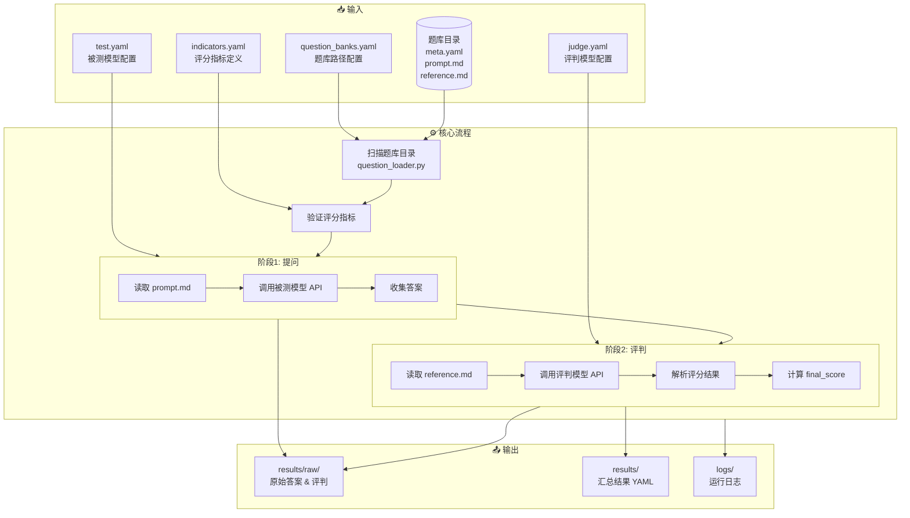
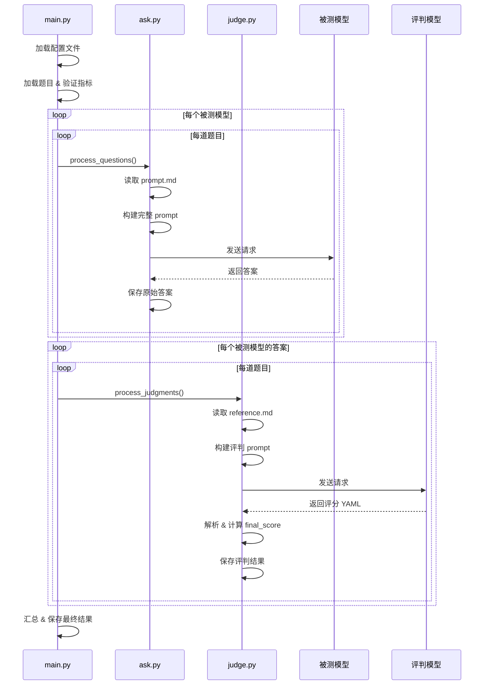

# CAC 评测系统 (code-fish)

一个用于自动化评测大语言模型（LLM）能力的 Python 程序。

> ✅ **已支持新格式**：自动扫描题库目录，读取 `meta.yaml` + `prompt.md` + `reference.md`

## 系统架构



## 评测流程详解



## 快速开始

### 1. 环境准备

```bash
cd code-fish

# 创建虚拟环境
python -m venv .venv

# 激活虚拟环境 (Windows PowerShell)
.\.venv\Scripts\Activate.ps1

# 安装依赖
pip install -r requirements.txt
```

### 2. 配置模型

#### 2.1 配置被测模型 (`providers/test.yaml`)

```yaml
test:
  - provider: openai
    api_key: sk-xxx
    base_url: https://api.xxx.com/v1
    model_name: gpt-4o-mini
    params:                    # 可选：模型参数
      temperature: 0.7
      max_tokens: 4096
  - provider: openai
    api_key: sk-xxx
    base_url: https://api.xxx.com/v1
    model_name: deepseek-v3

retry:
  max_attempts: 3
  delay: 10.0
```

#### 2.2 配置评判模型 (`providers/judge.yaml`)

```yaml
judge:
  provider: anthropic
  api_key: sk-xxx
  base_url: https://api.xxx.com/v1
  model_name: claude-sonnet-4-20250514
  params:
    temperature: 0.3

retry:
  max_attempts: 3
  delay: 10.0
```

### 3. 题目格式

程序自动扫描题库目录，读取标准化格式的题目：

```
数理能力基准测试题库/base-test/001-chicken-rabbit-cage/
├── README.md       # 人类阅读的完整文档（可选）
├── meta.yaml       # 元数据（id、评分指标等）
├── prompt.md       # 发给被测模型的 prompt
└── reference.md    # 标准答案/评判依据
```

题库路径配置在 `data/question_banks.yaml`：

```yaml
banks:
  - path: ../数理能力基准测试题库
    category: math
    name: 数理能力基准测试
  - path: ../代码能力基准测试题库
    category: code
    name: 代码能力基准测试
  # ...
```

评分指标定义在 `data/indicators.yaml`。

### 4. 运行评测

```bash
python main.py
```

### 5. 查看结果

```
results/
├── YYYYMMDD_HHMMSS.yaml    # 汇总结果
└── raw/
    ├── test/               # 被测模型原始答案
    ├── judge/              # 评判详细结果
    ├── input_test/         # 发送给被测模型的 prompt
    └── input-judge/        # 发送给评判模型的 prompt
```

## 评分指标

定义在 `data/indicators.yaml`：

| 类别 | 指标 | 说明 |
|------|------|------|
| **code** | `ans_correct` | 答案正确性 |
| | `code_quality` | 代码质量 |
| | `efficiency` | 运行效率 |
| | `robustness` | 鲁棒性 |
| **theory** | `completeness` | 回答完整性 |
| | `accuracy` | 准确性 |
| | `clarity` | 表达清晰度 |
| | `depth` | 深度 |

## 添加新的 LLM 提供商

1. 在 `src/adaptors/` 下创建新的适配器文件
2. 继承 `BaseLLMAdaptor` 类并实现 `chat()` 方法
3. 在 `src/adaptors/__init__.py` 中注册新适配器
4. 在配置文件中使用新提供商名称

## 目录结构

```
code-fish/
├── main.py                 # 主程序入口
├── requirements.txt        # Python 依赖
├── data/
│   ├── questions.yaml      # 题目元数据
│   ├── indicators.yaml     # 评分指标定义
│   ├── question_banks.yaml # 题库路径配置
│   └── questions/          # 题目内容目录
├── prompts/
│   ├── question.md         # 提问模板
│   └── judge.md            # 评判模板
├── providers/
│   ├── test.yaml.example   # 被测模型配置示例
│   └── judge.yaml.example  # 评判模型配置示例
├── src/
│   ├── ask.py              # 提问模块
│   ├── judge.py            # 评判模块
│   ├── logger.py           # 日志模块
│   ├── md2str.py           # Markdown 处理
│   └── adaptors/           # LLM 适配器
├── results/                # 评测结果（gitignore）
└── logs/                   # 运行日志（gitignore）
```

## 已完成功能

- [x] 实现题目加载器，支持从 `meta.yaml` + `prompt.md` + `reference.md` 读取题目
- [x] 自动扫描题库目录，无需手动维护 `questions.yaml`
- [x] 支持按题库类别和难度级别组织题目

## 待开发功能

- [ ] 支持按题库/难度筛选题目（命令行参数）
- [ ] 将测试结果写回题目目录的 `test-results/`
- [ ] 生成评测报告（HTML/Markdown）
