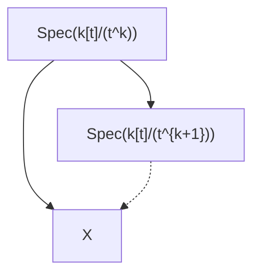

# Question

Let $X = \text{Spec}(k[[x,y]]/I) \subset \mathbb{A}^2$, where $I = (x^2, xy, y^2)$. Let $\mathfrak{m} = (x,y) \subset k[[x,y]]$. Set $V = \text{Hom}_k(I/\mathfrak{m}I, k)$. Then $V$ is the obstruction space for the canonical obstruction theory for the local ring of $X$ at the origin.
Consider the following special kind of extension problems. For $k=1, 2, 3, \dots$,

where the unique point of $\text{Spec}(k[[t]]/(t^k))$ is mapped to the origin.
Find all the elements in $V$ that show up as obstruction classes for this special kind of extension problems.
[Remark: A priori, the obstruction classes live in $V \otimes (t^k)/(t^{k+1})$. To identify it with $V$, we need to choose a basis for the 1-dimensional vector space $(t^k)/(t^{k+1})$. Of course there is a natural choice. But you will see that the answer to this problem is indeed independent of the choice.]

# Analysis

1. To show the linearity of the map, we need to verify that it preserves linear
combinations:
$f_1\varphi_1 + f_2\varphi_2 \to f_1 d(\varphi_1(s)) + f_2d(\varphi_2(s))$
where $f_1, f_2 \in O_X$. We just need to proof that $\varphi(s) = 0$ at $\Omega_W|_X$, and the
statement above comes from Leibniz rule.But $X = V(s)$ so $\varphi(s)|_X = 0$ is
clearly true.
2. It's easy to see that $I = m^2$. Now we need to verify whether a map $u$:
$k[x, y]/m^2 \leftrightarrow k[t]/(t^n)$
extends to $u'$:
$k[x, y]/m^2 \to k[t]/(t^{n+1})$
Choose a basis so:
$u(x) = \alpha t^p + \text{higher terms}, u(y) = \beta t^p + \text{higher terms}$
and
$u(x^2) = u(xy) = u(y^2) = 0$
We analyze this based on $n$.
(a) $n$ is odd So $n = 2p - 1$.Then
$u'(x^2) = \alpha^2 t^{2p} + \text{higher terms}, u'(xy) = \alpha\beta t^{2p} + \text{higher terms}, u'(y^2) = \beta^2 t^{2p} + \text{higher terms}$
Which are all $0$ mod out $n + 1$
(b) $n$ is even So $n = 2p$. Then
$u'(x^2) = \alpha^2 t^{2p} + \text{higher terms}, u'(xy) = \alpha\beta t^{2p} + \text{higher terms}, u'(y^2) = \beta^2 t^{2p} + \text{higher terms}$
mod out $n + 1$ then we have:
$u'(x^2) = \alpha^2 t^{2p}, u'(xy) = \alpha\beta t^{2p}+, u'(y^2) = \beta^2 t^{2p}$
And that's the obstruction class at $V \otimes (t^n)/(t^{n+1})$
In conclusion:
When $n$ is odd then the obstruction class at $V\otimes(t^n)/(t^{n+1})$ vanishes; when
$n$ is even then the obstruction class at $V \otimes (t^n)/(t^{n+1})$ is $(\alpha^2, \alpha\beta, \beta^2)$.